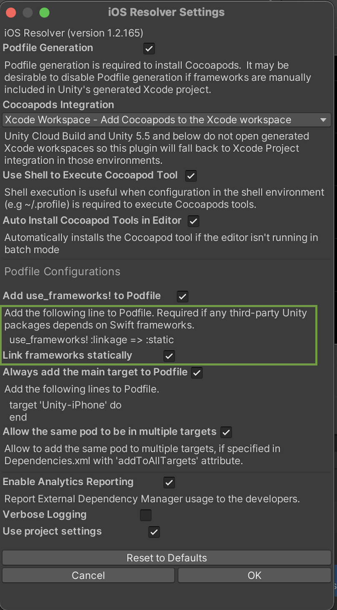

![alt text][logo]

[logo]: images/MiniclipLogo.png "Miniclip Logo"
# MUAds

## Getting Started

### Step 1 - Integrate the module

1. Import the `MUAds.unitypackage` into your project.

2. After the import phase, the module will check for the existence of the `unity-jar-resolver`.
If the it is not present, a popup will appear that will open its [download page](https://github.com/googlesamples/unity-jar-resolver/raw/master/external-dependency-manager-latest.unitypackage).

&nbsp;

### Android integration

##### 1. Enable Jetifier and Java 8  

*Note: For older versions of* ***External Dependencies Manager*** *the name of the tool is* ***Play Services Resolver***.

This version of MUAds already targets `AndroidX`, but your project may still have some dependencies that are not prepared for this. In order to ensure compatibility, you should enable the `Android Jetifier` on the `PlayServicesResolver`. This can be done by:

1. Going to `Assets` (Top menu) > `External Dependencies Manager` > `Android Resolver` > `Settings`
2. On the `Settings` menu ensure that the `Enable Jetifier` is ticked.
3. On the same menu (`Settings`), we highly recommend that you have the flag `Patch mainTemplate.gradle` active - this prevents the download of the libs to `Assets/Plugins/Android`.

This should write something like this in your `mainTemplate.gradle` file:

```groovy
([rootProject] + (rootProject.subprojects as List)).each {
    ext {
        it.setProperty("android.useAndroidX", true)
        it.setProperty("android.enableJetifier", true)
    }
}
```

You will also need to add Java 8 compatibility. This can be done by adding the following snippet to your `mainTemplate.gradle`:  

```groovy
// You can add the complileOptions closure to an already existing android closure.

android {
    compileOptions {
        sourceCompatibility 1.8
        targetCompatibility 1.8
    }
}
```


##### 2. Check minSDK value
Some mediation adapters currently have a dependency on `Android minSDK 19`. If you are using this network you will need your project to set its `minSDK` to at least 19.
In order to change this setting you should go to:

1. `Build Menu` > `File` (Top menu) > `Build Settings` > (Optional) Select the `Android` target and `Switch Platform` > `Player Settings`
2. On the `Player Settings` view > On the `Other Settings` tab > Scroll to `Configuration` and change the value of `Minimum API level` to 19 (Android 4.4 KitKat)

##### 3. AdMob SDK now require extra configuration on `AndroidManifest.xml`. You need to add your application keys *or the app will crash* on initialization. This can be done by using the MUAds Editor Menu `Miniclip/MUAds/ConfigurationHelper` and filling in the `AdMob App Id Android` value - or manually.
##### Additionally, you should Delay App Measurement by AdMob. This can be done on the same menu, by ticking the value that referes to it.

For more information, please refer to [Android Delay App Measurement](https://developers.google.com/admob/android/eu-consent#delay_app_measurement_optional).

##### 4. Facebook Audience Network recommends the usage of a Network Security Configuration File in order to enable the caching of media files in the SDK. [Caching on Android 9 - FAN](https://developers.facebook.com/docs/audience-network/android-network-security-config/). The file `/res/xml/network_security_config.xml` is already present in the package, but you need to make an amend to your `<application>` tag in order for it to be functional. 

<details><summary>network\_security\_config.xml example (click to expand)</summary>

```xml
<?xml version="1.0" encoding="utf-8"?>
<manifest ... >
    <application android:networkSecurityConfig="@xml/network_security_config"
    ... >
        ...
    </application>
</manifest>
```
</details>

##### 5. LaunchTemplate.gradle ***(for Unity versions higher than 2019.3)***
If you are running a Unity version higher than `2019.3`, Unity will split your Android project in two, a library controlled by `mainTemplate.gradle` and the application controlled by `launchTemplate.gradle`. When compiling, if you get multidex problems, this will likely have to do with `launchTemplate.gradle`. This is what you should do to fix it:  

1. Go to `PlayerSettings` and access the `Publishing Settings` tab; 
2. In there you have a check-box with the text: `Custom Launcher Gradle Template` - enable it. This will create a `launcherTemplate.gradle` file, typically next to your `mainTemplate.gradle` under `Assets/Plugins/Android`;
3. In this `launchTemplate.gradle` file that was just created, please edit the closure by adding multiDex support:

```
android {
	defaultConfig{
		...
		multiDexEnabled true
	}
}	
```

##### 6. (Optional) Unity projects, by default have the Advertisement SDK enabled. This conflicts with UnityAds SDK for Android. To solve this problem, on the Unity Editor you should go to:
1. `Window` > `Package Manager` (or `Asset Manager` depending on the version) 
2. Then under `Ads` (or `Advertising` depending on the version) you should click `Remove` on the top right corner.

##### 7. Networks Selection

Get in touch with your Advertising representative to know which networks and mediations should be enabled on Android in your game.
Once you have that list go to `Miniclip/MUAds/Ad Networks Selector`. This will open a window where you will be able to enable and disable networks and mediations. Only have the necessary mediations and networks enabled to reduce build size.
Note that the tool will not allow you to remove networks that are mediating and will automatically enable networks that were selected to mediate. The network SDK is necessary to mediate other networks.

&nbsp;

### iOS integration

##### 1. AdMob SDK (7.42+ iOS) now require extra configuration on `Info.plist`. You need to add your application keys *or the app will crash* on initialization. This can be done by using the MUAds Editor Menu `Miniclip/MUAds/ConfigurationHelper` and filling in the `AdMob App Id iOS` value - or manually.
##### Additionally, you should Delay App Measurement by AdMob. This can be done on the same menu, by ticking the value that referes to it.

For more information, please refer to [AdMob Get Started iOS](https://developers.google.com/admob/ios/quick-start).

##### 2. iOS 14 - MUAds will automatically create the necessary `SKAdNetworkItems` on the game's `Info.plist` file for the ad networks that are our most common partners.

For more information about the iOS 14 changes and the SKAdNetwork requirement, please refer to [Apple iOS 14 - SKAdNetwork documentation](https://developer.apple.com/documentation/storekit/skadnetwork/configuring_the_participating_apps)

##### 3. Networks Selection

Get in touch with your Advertising representative to know which networks and mediations should be enabled on iOS in your game.
Once you have that list go to `Miniclip/MUAds/Ad Networks Selector`. This will open a window where you will be able to enable and disable networks and mediations. Only have the necessary mediations and networks enabled to reduce build size.
Note that the tool will not allow you to remove networks that are mediating and will automatically enable networks that were selected to mediate. The network SDK is necessary to mediate other networks.

##### 4. Building MUAds on iOS (for versions 5.X+)
If you are building MUAds on iOS for versions higher than 5.0.0, you will need to force the `External Dependencies Manager` to `Link frameworks statically`. In onder to do this, please go to the Window Menu `Assets` > `External Dependencies Manager` > `iOS Resolver` > `Settings` (See the picture below for reference).

&nbsp;

  

&nbsp;

In there, you will want to enable the setting `Link frameworks statically`, as shown in the following picture.

&nbsp;

 

&nbsp;

##### 5. Forcing `UnityFramework.framework` linkage

On some versions of Unity (namely 2019.3.X) there have been reports of Watchdog crashes on initialization (more info on the FAQ). If you are on such a version, consider enabling the forced linkage on the `Miniclip/MUAds/Configuration Helper` Editor Menu.

&nbsp;

### Step 2 - Runtime configuration setup

*Note: All the MUAds types are defined in the* ***Mu.Ads*** *namespace, which will be omitted for the rest of the documentation.*

Once the integration is done, your application needs to set up MUAds. This is done through the `Configurator` class.

If you wish to have logs enabled (they will be enabled by default on debug builds only), you can use the following method:

```c#
Configurator.SetLoggingEnabled(true);
```

If the application will use offer walls or rewarded videos, a user id needs to be set in order to properly hand out rewards:

```c#
Configurator.SetUserId("<Current User Id>");
```

You will need to let MUAds know from which data protection policy the user is protected by. MUAds, right now, supports the following policies:

```c#
//User is not protected by any data protection policy
NoDataProtection();

//User is protected by GDPR
GDPRDataProtection(<true/false>);
//true means the user gave consent for targeted ads, false otherwise

//User is protected by CCPA
CCPADataProtection(<true/false>);
//true means the user allows selling their data, false otherwise
```

Select the one that represents the policy the user is protected by and setup the mediation with it. Each mediator will require different parameters:

```c#
bool setupIronSourceSuccess = Configurator.SetupIronSource("<AppKey>", new GDPRDataProtection(<true/false>));  // Your ironSource App Key
bool setupAdMobSuccess = Configurator.SetupAdMob(new GDPRDataProtection(<true/false>)); // We use AdMob's appkey provided in the ConfigurationHelper editor menu
```

You can listen to events regarding the Initialization of the mediators via the `ConfiguratorListener` Interface. Do not try to PreLoad ads before these callbacks are called.

```c#
 private class CustomListener : IConfiguratorListener{      
    public void OnIronSourceInitialized ()
    {
        // Game logic
    }

    public void OnAdMobInitialized ()
    {
        // Game logic
    }
 }

 Configurator.SetListener(new CustomListener());
```

### Step 2.1 (For AdMob Mediation) AdMob Mediation Dev Setup
By default, `DEBUG` builds will automatically set your device as a test device to receive AdMob test ads.
If, by any chance, you are not able to do `DEBUG` builds, you can opt to activate `Sandbox Mode` while doing the AdMob mediation setup.  
Important: Do not have `Sandbox Mode` activated for production.

### Step 3 - Showing an ad

The process to show an ad is described in the following sections, depending on the ad type:

* [Interstitials](interstitials.md)
* [Rewarded Videos](rewarded_videos.md)

### Step 4 - Add Standard Ad Events reporting to your game

This will provide ad metrics and allow our advertising team to further optimize the revenue of the game. The process of event reporting is described in section [Event Report](event_report.md).
